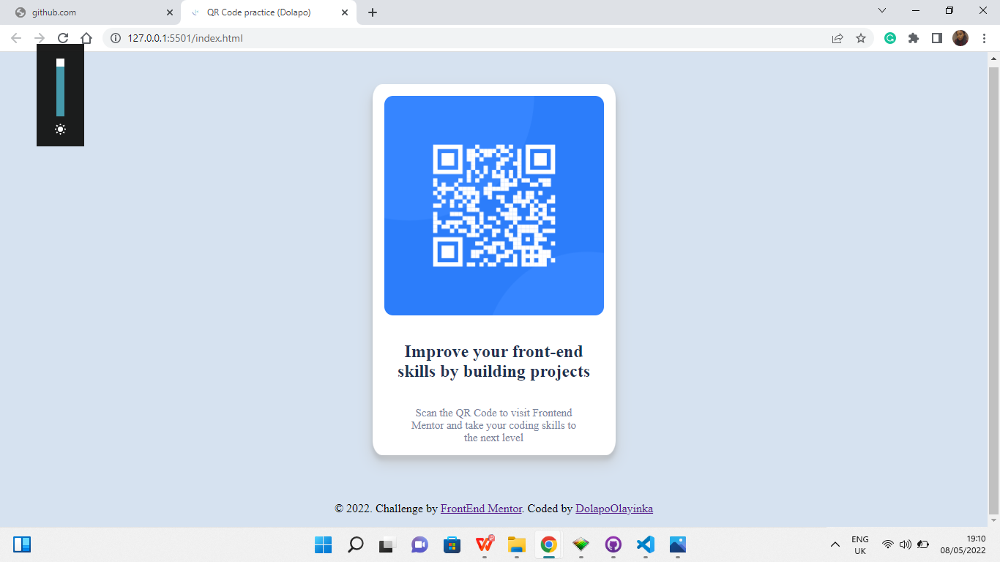
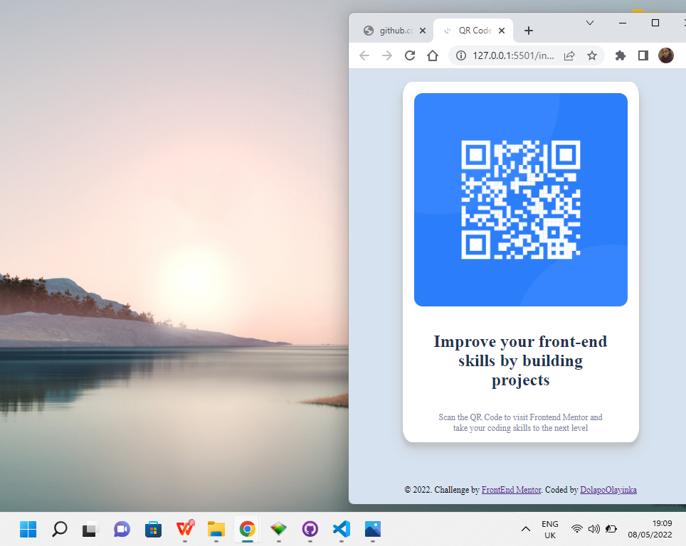

## Table of contents

- [Overview](#overview)
  - [Screenshot](#screenshot)
  - [Links](#links)
- [My process](#my-process)
  - [Built with](#built-with)
  - [What I learned](#what-i-learned)
  - [Continued development](#continued-development)
  - [Useful resources](#useful-resources)
- [Author](#author)
- [Acknowledgments](#acknowledgments)


## Overview
This project, qr-code-component was built using HTML and CSS


### Screenshot




### Links
- Solution URL: [Add solution URL here](https://github.com/DolapoOlayinka/qr-code-fem)
- Live URL: [Add Live URL here](https://dolapoolayinka.github.io/qr-code-fem/)


## My process
- I wrote the HTML codes first then added the styling to the page
- I worked on the image first, the width and height and also justified it to the center of the page
- Then I worked on creating the container around the images and texts
- Then finally, I adjusted the font sizes, widthm height and padding of the texts


### Built with
- Semantic HTML5 markup
- CSS custom properties
- CSS Flexbox


### What I learned
I learnt to adjust contents to the center of the screen, I had to create divs for them first

I'm most proud of this code snippet because I thought I had forgotten how to use box shadows but when I started coding, I got the inspiration instantly
```css
.main-body{
    background-color: white;
    border-radius: 4%;
    box-shadow: 0 10px 20px rgb(200, 202, 204), 
                0 6px 6px rgba(0,0,0,0.23);
}

I'm also porud of the fact that I had to figure out how to make the code work all by myself without any external help


### Continued development
I'd like to learn more on responsiveness, and how to efficiently use flexbox and CSS properties in general


## Author
- Website - [Dolapo Olayinka](https://github.com/DolapoOlayinka)
- Frontend Mentor - [@DolapoOlayinka](https://www.frontendmentor.io/profile/DolapoOlayinka)
- Twitter - [@adedolap0r](https://www.twitter.com/adedolap0r)
